# Configuring Keycloak

There are multiple methods of deploying Keycloak. Documentation on Keycloak deployment can be found on the [Official Keycloak website](https://www.keycloak.org/guides#getting-started). 

:::info Docker Quickstart
With Docker installed and running on your system you can quickly spin up Keycloak by running:

```bash
docker run --name keycloak -d \
  -p 8080:8080 \
  -e KEYCLOAK_ADMIN=admin \
  -e KEYCLOAK_ADMIN_PASSWORD=admin \
  quay.io/keycloak/keycloak:22.0 start-dev
```
If you need to install Docker, visit the [official Docker installation guide](https://docs.docker.com/get-docker/).

This command starts Keycloak on local port `8080` and creates an initial admin user with the username `admin` and password `admin`.

:::

:::warning Development Configuration
This setup is designated for development and testing purposes and should not be used in production settings. For production deployments, please refer to [Configuring Keycloak for Production](https://www.keycloak.org/server/configuration-production).
:::

## Overture API Key Provider

The Overture API Key provider extends Keycloak's functionality by adding custom logic that allows Keycloak to interact with Song. The following steps outline how to download and install the Overture API Key provider:

  1. **Download the [Overture API Key Provider](https://github.com/oicr-softeng/keycloak-apikeys/releases/download/1.0.1/keycloak-apikeys-1.0.1.jar)**.
  2. **Move the** `keycloak-apikeys.jar` file to the provider's folder within Keycloak (`opt/keycloak/providers/`).
  3. **Restart the Keycloak server** for the updated provider to take effect.

      :::info Previously Set Up Keycloak?
      If you have previously set up Score with Keycloak, you can skip ahead to the application setup section on this page.
      :::

## Realm Configuration

### Login to the admin console

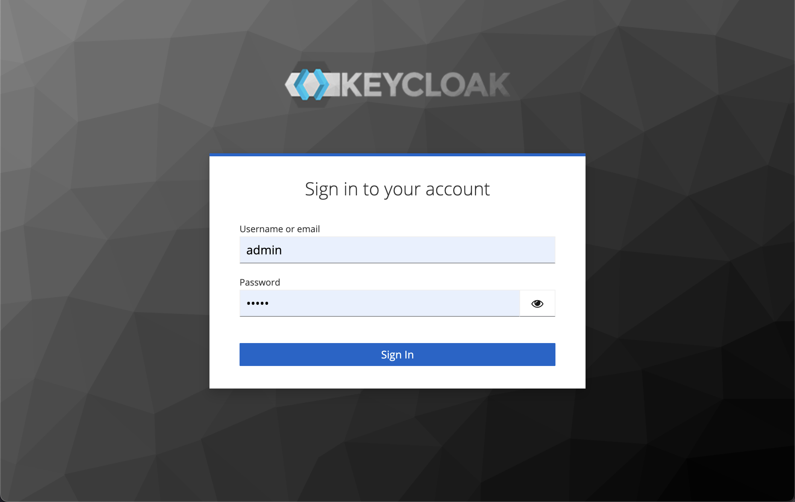

To access the admin console, navigate to `<url>/admin` (e.g., `localhost:8080/admin`) and log in with the credentials made during your Keycloak deployment.

### Create a realm

Keycloak supports the creation of realms for managing isolated groups of applications and users. The default realm is named "master," and is intended solely for Keycloak management.

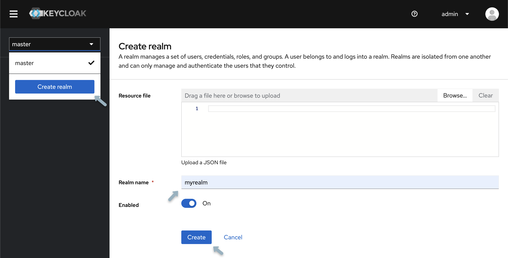

1. Open the **Keycloak Admin Console**.
2. In the top-left corner, **select "master"**, then choose **"Create Realm".**
3. **Type** `myrealm` in the Realm Name field and select **"Create".**

### Creating a group

As an example, we will create a `data submitters` group. After, we will configure and apply the appropriate permissions for this group.

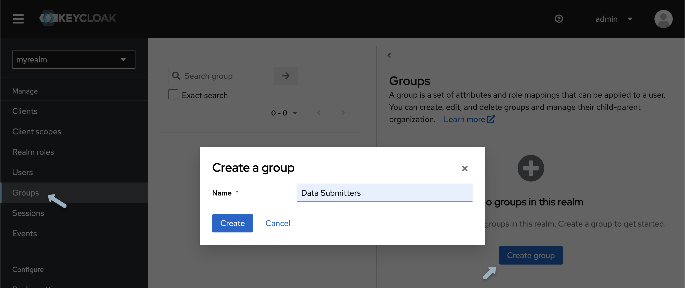

1. From the left-hand panel, select **"Groups"** and click **"Create group"**.

2. **Name the group** `data submitters` and select **"create"**.

### Creating a User

To populate the realm with its first user:

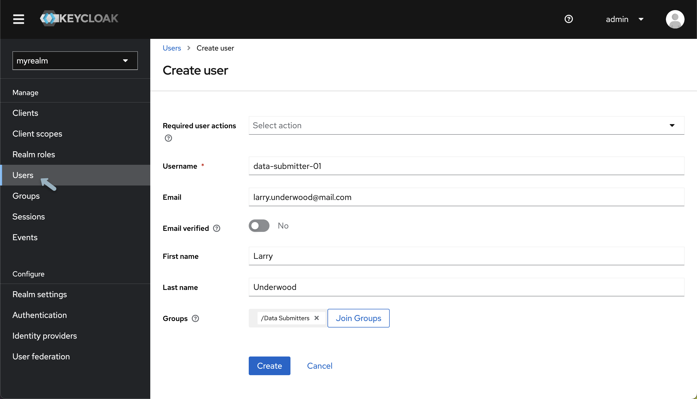

1. From the **Keycloak Admin Console**, under your newly created realm from the left-hand menu select **"Users"** and click **"Add User".**
2. **Input your details**, and then click **"Create"**.

    :::info Keycloak User Administration
    Various configurations can be applied to new users, detailed information can be found within [Keycloaks official Server Administration documentation](https://www.keycloak.org/docs/latest/server_admin/)
    :::

Next, a password must be established:

1. At the top of the **User details page**, select the **"Credentials tab"**
2. **Input your Password**. To avoid mandatory password updates upon first login **set "Temporary" to "Off"**
3. Using the newly created username and password **login to the Keycloak Account Console** accessed from `http://localhost:8080/realms/myrealm/account/`.

    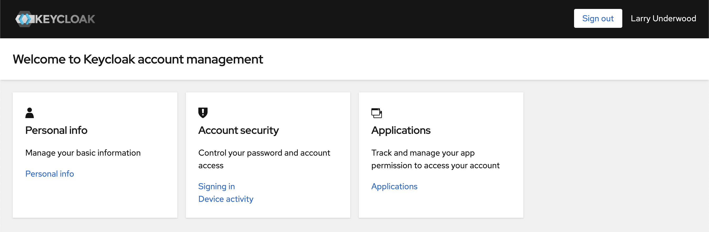

From the Account Console, users can manage their accounts, modify profiles, activate two-factor authentication, and link identity provider accounts.
## Application Setup

Before we set up and apply permissions we must create a "client" for the Song API.

1. Re-open your Keycloak admin console located at `<url>/admin` and confirm you are within your recently created realm.
2. Select **"Clients"** and then **"Create client"** and input the following:

    | Field      | Value          |
    |------------|----------------|
    | **Client Type**   | OpenID Connect  |
    | **Client ID** | song-api |

3. Select **"Next"** and **turn on Client Authentication**, confirm **Standard flow is enabled**, turn **authorization on** and then click **"next"** and then **"Save"** (Nothing needs to be inputted for login settings).

    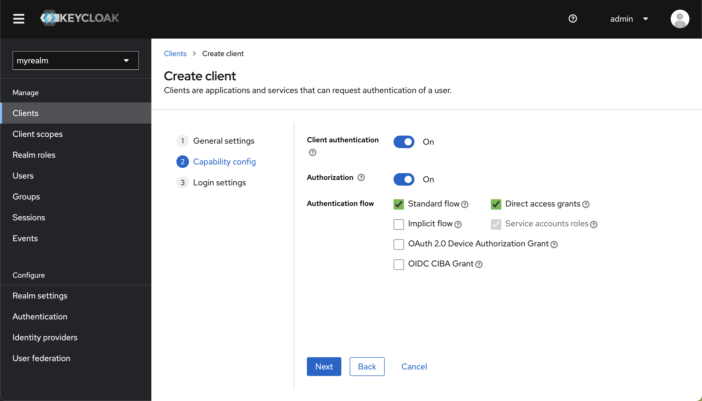

    :::info Important
    Make sure you have toggled on both **"Client Authentication"** and **"Authorization"**
    :::

### Configuring your Application

After creating our client, the next step is configuring the resource name, scopes, policies, and permissions. All these settings can be adjusted within the **Authorization tab** of the client you've just created. To access your client select **"Clients"** from the left-hand navigation menu and from the **"Client list"** select the newly created client.

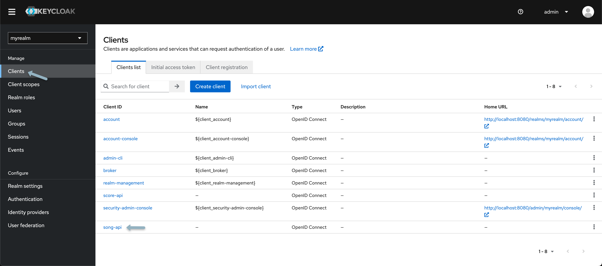

#### Scopes

Scopes represent actions that users can perform on a particular resource. They define the level of access a user has to a resource, such as reading, writing, updating, or deleting. For more details, checkout the following [Keycloak documentation](https://www.keycloak.org/docs/latest/authorization_services/index.html#scope)

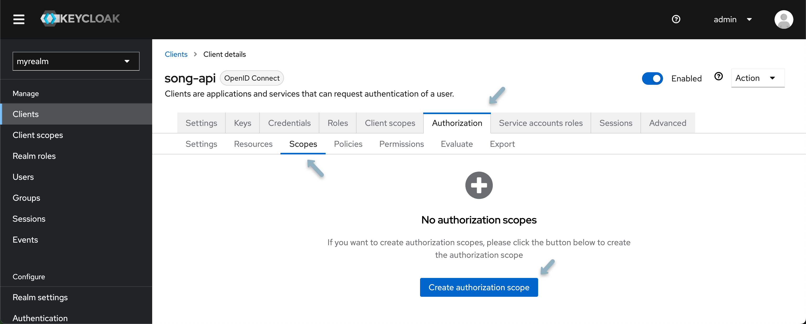

1. Navigate to the **Scopes tab** and select **"Create Authorization Scope"**
2. **Create two authorization scopes**, one for **READ** and one for **WRITE** access.

#### Resources

Resources are objects or entities that users can interact with, such as a database, a file, or an API endpoint. When defining resources, you assign them to specific scopes, indicating what actions can be performed on those resources. For more details, checkout the following [Keycloak documentation](https://www.keycloak.org/docs/latest/authorization_services/index.html#resource)

1. From the **Resource tab**, select **"Create Resource"**.
2. Your first resource is generalized and will not be associated with any specific study or program. Name the resource `score`, and from the **authorization scopes field** dropdown select **"READ" and "WRITE"**.
3. **Click save** and return to the client details page.

    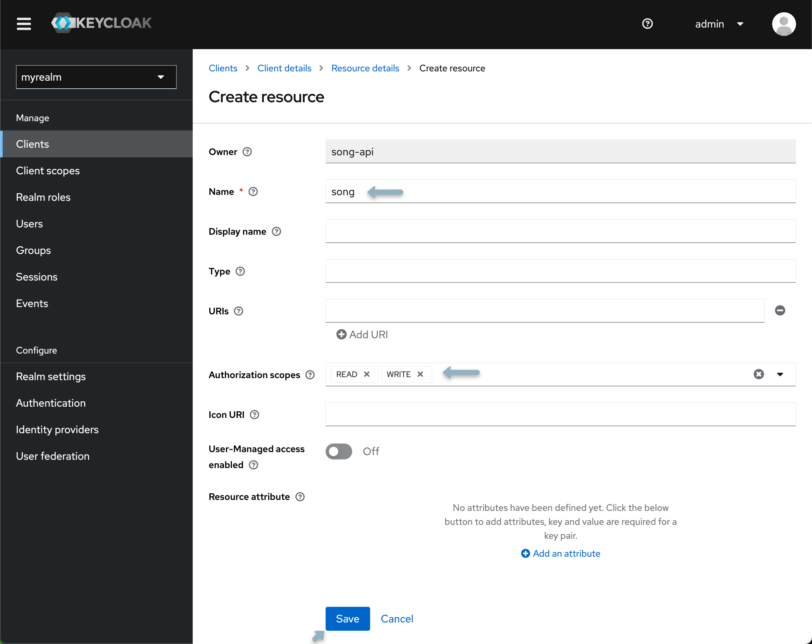

    :::info Introducing New Studies or Programs
    When introducing a new study or program, the creation of an additional resource within Keycloak is required. This includes re-applying the following policies, scopes, and permissions to desired users and groups.
    :::

#### Policies

Policies are rules that determine who can access resources based on certain conditions. They encapsulate the logic to decide whether to grant or deny access. Policies can be based on group membership, user attributes, or time-based conditions. For more details, checkout the following [Keycloak documentation](https://www.keycloak.org/docs/latest/authorization_services/index.html#policy)

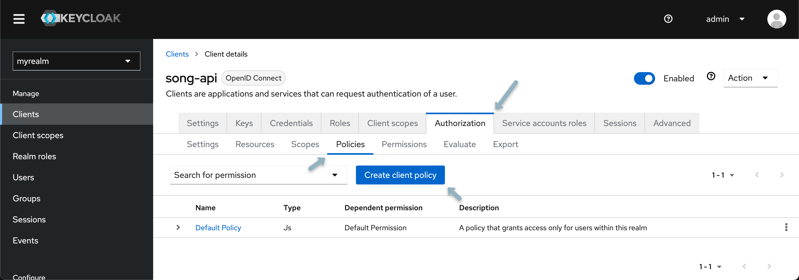

1. Select the **Policy tab** and click **"Create Client Policy"**
2. From the popup modal select **"group policy"**.
3. Name your policy (e.g., `data submission policy`) and select **"Add groups** from the modal check the box next to the Data Submitter group and click **"Add"** then **"Save"**.

#### Permissions

Permissions are the final decision-making mechanism connecting resources, scopes, and policies. They define which users or groups can access which resources under what circumstances. Permissions are evaluated based on the evaluation strategy chosen (e.g., Affirmative, Unanimous, or Consensus). Permissions can be resource-based, meaning they apply directly to a resource, or they can be scope-based, meaning they apply to a scope or combination of scopes and resources. For more details, checkout the following [Keycloak documentation](https://www.keycloak.org/docs/latest/authorization_services/index.html#permission)

1. Select the **permissions tab**, click **"Create Permission"** and from the dropdown select **"Create resource-based permission**.
2. Assign the newly created resource, scope, and policy. Select `Affirmative strategy`.

## Creating a New Study

As mentioned previously, when introducing a new study or program, the creation of an additional resource within Keycloak is required. This includes re-applying policies and permissions to desired users and groups.

To add a new study, **create a new resource** with the desired name of your study or program (i.e. `PROGRAM.study123`) and **repeat the steps outline above**, specifically the Resources, Policies and Permissions sections of configuring your application. Once complete you should have the following:

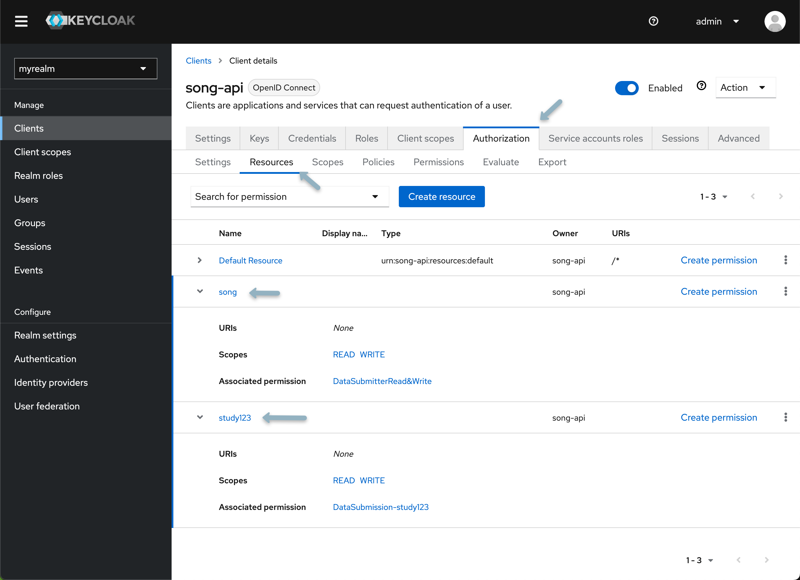

### Integration with Song

Update your Song configuration by adding these Keycloak variables to your `.env.song` file:

```bash
# Keycloak Integration
SPRING_CONFIG_ACTIVATE_ON_PROFILE=secure

# Server Configuration
AUTH_SERVER_PROVIDER=keycloak
AUTH_SERVER_TOKENNAME=apiKey
AUTH_SERVER_KEYCLOAK_HOST={keycloak-host-url}
AUTH_SERVER_KEYCLOAK_REALM=myrealm
AUTH_SERVER_CLIENTID={song-client-ID}
AUTH_SERVER_CLIENTSECRET={song-client-secret}

# Scope Configuration
AUTH_SERVER_SCOPE_STUDY_PREFIX=PROGRAM.study123
AUTH_SERVER_SCOPE_STUDY_SUFFIX=.WRITE
AUTH_SERVER_SCOPE_SYSTEM=song.WRITE

# Authentication Endpoints
AUTH_SERVER_INTROSPECTIONURI={keycloak-host-url}/realms/{keycloak-realm}/apikey/check_api_key/
SPRING_SECURITY_OAUTH2_RESOURCESERVER_JWT_PUBLIC_KEY_LOCATION={keycloak-host-url}/realms/{keycloak-realm}/protocol/openid-connect/certs
```

Replace any default values with the values specific to your environment. The variables are explained in detail below:

<details>
<summary>**Click here for details**</summary>

**Server Authentication Integration**
- `AUTH_SERVER_PROVIDER`: Required - Specify the authentication server provider. In this case, it's set to `keycloak`
- `AUTH_SERVER_KEYCLOAK_HOST`: Required - The host address for the Keycloak server. Default is `http://localhost` update this variable accordingly
- `AUTH_SERVER_KEYCLOAK_REALM`: Required - The realm in Keycloak under which the Score service is registered. Example: `myrealm`
- `AUTH_SERVER_URL`: Required - URL for the Keycloak API endpoint authenticating a user's API key. Specify the full endpoint URL by inserting your realm name
- `AUTH_SERVER_TOKENNAME`: Required - Name identifying a token. Keep this as the default value `apiKey`
- `AUTH_SERVER_CLIENTID`: Required - The client ID for the Score application configured in Keycloak
- `AUTH_SERVER_CLIENTSECRET`: Required - The client secret for the Score application configured in Keycloak. This can be accessed from the **"Client details"** under the **"Credentials tab"**

**Scope Configuration**
- `AUTH_SERVER_SCOPE_DOWNLOAD_SYSTEM`: Required - Scope (permission) for system-level downloads from Score using an API key. Default: `score.WRITE`
- `AUTH_SERVER_SCOPE_DOWNLOAD_SUFFIX`: Required - Suffix after the Song study name when assigning study-level download scopes for Score. Default: `.READ`
- `AUTH_SERVER_SCOPE_UPLOAD_SYSTEM`: Required - Scope (permission) for system-level uploads to Score using an API key. If following the above instructions for application setup this value will be `score-api.`
- `AUTH_SERVER_SCOPE_UPLOAD_SUFFIX`: Required - Suffix after the Song study name when assigning study-level upload scopes for Score. Default: `.WRITE`

**JWT Configuration**
- `SPRING_SECURITY_OAUTH2_RESOURCESERVER_JWT_JWKSETURI`: Required - URI for JWT JSON Web Key Set (JWK Set) for the OAuth2 resource server. Specify the Keycloak server URI by inserting your realm name

</details>

:::info Need Help?
If you encounter any issues or have questions about our API, please don't hesitate to reach out through our relevant [**community support channels**](https://docs.overture.bio/community/support).
:::
